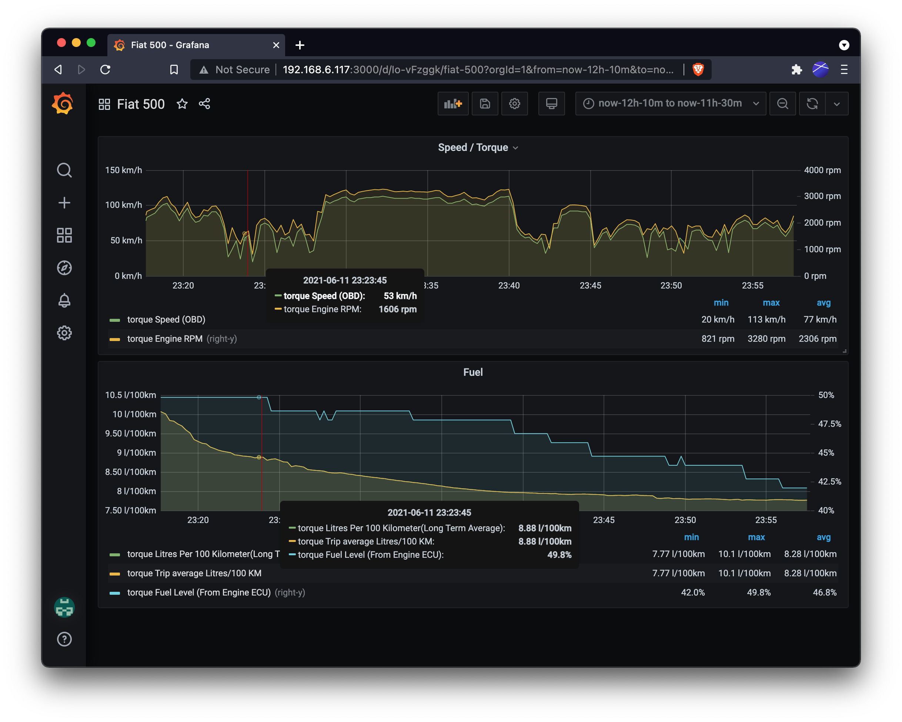

# Torque Home Assistant Proxy

Make Torque web logging compatible for Home Assistant again.

## Problem

[Just following Home Assistant Torque Integration guide isn't enough anymore](https://www.home-assistant.io/integrations/torque/). Torque web logging supports only http and Home Assistant doesn't authenticate the user using `?api_password=YOUR_PASSWORD` query param anymore.

So you need a proxy that supports both https and adds the [long lived token](https://developers.home-assistant.io/docs/auth_api/#long-lived-access-token) inside headers request to authenticate the user correctly.

This little proxy solves both problems.

You can compile it and run it on your Android phone using [Termux](https://termux.com/).

For example, if you compile it and call it `termux-proxy`. You can run it

```bash
./termux-proxy -url <YOUR_HOME_ASSISTANT_URL> -token <HOME_ASSISTANT_LIVE_TOKEN>
```

then you have the port `8090` open and you can put `http://localhost:8090/api/torque` in Torque -> Settings -> Data Logging & Upload -> Webserver URL.

Finally, you should see torque data in your Home Assistant! If you add also [prometheus](https://www.home-assistant.io/integrations/prometheus/) + [grafana](https://grafana.com/), you can have also graphs like this.



## FAQ

- *Too many steps just to record torque data! Is there any way to simplify it?* No, but you can automate everything with [Tasker](https://play.google.com/store/apps/details?id=net.dinglisch.android.taskerm&hl=it&gl=US). If my phone connects with my OBD dongle, Tasker starts automatically both torque and this proxy using [Termux:Tasker](https://play.google.com/store/apps/details?id=com.termux.tasker&hl=it&gl=US).
- *How did you find this workaround?* This proxy is heavily inspired from this [Github comment](https://github.com/home-assistant/core/issues/28836#issuecomment-579887196). I chose Go because I don't want to use nodeJS runtime on my android phone, I wanted a native program.

## Support my work

Everything I made is open source.
If you like what I'm doing and you want to support me, you can help me 😄!

- Sponsor me with [Github](https://github.com/sponsors/matitalatina)
- [Buy me a coffee](https://www.buymeacoffee.com/mattianatali)
- [Paypal](https://paypal.me/mattianatali)